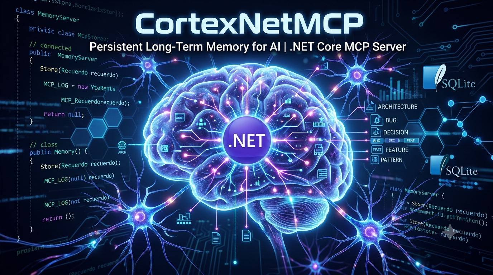

<p align="center">
  
</p>

# CortexNetMCP

> Memoria a largo plazo para tu IA. No más contexto perdido entre sesiones.

**CortexNetMCP** es un servidor nativo de **.NET 10** que implementa el **Model Context Protocol (MCP)**, diseñado para actuar como sistema de memoria persistente para asistentes de IA como GitHub Copilot, Claude Code, Cursor y similares.

Tu IA guarda decisiones de arquitectura, bugs resueltos, patrones de diseño y conocimiento técnico directamente en una base de datos local. En la próxima sesión, lo recupera automáticamente antes de empezar a trabajar.

---

## Por qué usarlo

| Problema | Solución con CortexNetMCP |
|---|---|
| La IA olvida todo al cerrar el chat | Las memorias persisten en SQLite localmente |
| Repetir siempre el mismo contexto al inicio | `RecordarContextoProyecto` carga lo relevante automáticamente |
| Bugs que vuelven a aparecer | Los recuerdos de tipo `bug` los documentan con causa y solución |
| Decisiones de diseño que se pierden | Categorías `architecture` y `decision` las preservan para siempre |
| Funciona solo en tu máquina | Distribución multiplataforma vía .NET Global Tool en NuGet |

---

## Requisitos previos

- [.NET 10 SDK](https://dotnet.microsoft.com/download) o superior
- Un cliente MCP compatible: [GitHub Copilot en VS Code](https://marketplace.visualstudio.com/items?itemName=GitHub.copilot), [Claude Code](https://claude.ai/code), [Cursor](https://www.cursor.com/), etc.

---

## Instalacion rapida (.NET Global Tool)

Este es el metodo recomendado. No requiere clonar el repositorio ni configurar rutas.

**1. Instalar desde NuGet:**

```bash
dotnet tool install -g CortexNetMCP
```

Esto descarga el paquete y genera automaticamente un ejecutable global `cortexnetmcp` disponible desde cualquier terminal.

**2. Verificar la instalacion:**

```bash
cortexnetmcp --version
```

**3. Actualizar a la ultima version:**

```bash
dotnet tool update -g CortexNetMCP
```

**4. Desinstalar:**

```bash
dotnet tool uninstall -g CortexNetMCP
```

---

## Compilacion manual (para desarrolladores)

Si quieres modificar el codigo fuente o generar un binario autonomo para distribuir sin depender del SDK de .NET del usuario final:

**Clonar y construir:**

```bash
git clone https://github.com/tu-usuario/CortexNetMCP.git
cd CortexNetMCP/CortexNetMCP
dotnet build
```

**Ejecutable unico y autocontenido para Windows x64:**

```bash
dotnet publish -c Release -r win-x64 --self-contained true /p:PublishSingleFile=true /p:PublishTrimmed=false
```

El binario resultante se ubica en:

```
bin/Release/net10.0/win-x64/publish/CortexNetMCP.exe
```

Equivalentes para otras plataformas:

```bash
# Linux x64
dotnet publish -c Release -r linux-x64 --self-contained true /p:PublishSingleFile=true /p:PublishTrimmed=false

# macOS ARM (Apple Silicon)
dotnet publish -c Release -r osx-arm64 --self-contained true /p:PublishSingleFile=true /p:PublishTrimmed=false
```

**Generar el paquete NuGet (.nupkg):**

```bash
dotnet pack -c Release
```

---

## Configuracion en VS Code (GitHub Copilot)

Abre la configuracion global de VS Code (`Ctrl+Shift+P` → `Open User Settings (JSON)`) y agrega la siguiente entrada:

```json
"github.copilot.chat.mcp.servers": {
  "CortexNetMCP": {
    "command": "cortexnetmcp",
    "args": [],
    "env": {}
  }
}
```

> **Modo desarrollo:** Si estas ejecutando desde el codigo fuente sin instalar el Global Tool, reemplaza `"command": "cortexnetmcp"` por la ruta absoluta al ejecutable compilado, por ejemplo:
> `"command": "C:/ruta/al/proyecto/bin/Release/net10.0/win-x64/publish/CortexNetMCP.exe"`

Reinicia VS Code. GitHub Copilot detectara el servidor MCP automaticamente.

---

## Configuracion en Claude Code

Agrega el servidor al archivo de configuracion MCP de Claude Code (`~/.claude/mcp.json` o el de tu proyecto):

```json
{
  "mcpServers": {
    "CortexNetMCP": {
      "command": "cortexnetmcp",
      "args": []
    }
  }
}
```

---

## Herramientas MCP disponibles

Una vez conectado, tu IA tendra acceso a las siguientes 9 herramientas:

| Herramienta | Descripcion |
|---|---|
| `GuardarRecuerdo` | Guarda un recuerdo tecnico con titulo, contenido, tags y rutas de archivos |
| `BuscarRecuerdos` | Busqueda full-text (FTS5) sobre titulo, contenido, tags y archivos |
| `ObtenerRecuerdosPorCategoria` | Lista todos los recuerdos de un proyecto filtrados por categoria |
| `ObtenerRecuerdoPorId` | Recupera el contenido completo de un recuerdo por su ID |
| `ActualizarRecuerdo` | Actualiza titulo, contenido, tags y rutas de archivos de un recuerdo |
| `EliminarRecuerdo` | Elimina permanentemente un recuerdo y todas sus relaciones |
| `RelacionarRecuerdos` | Crea una relacion semantica entre dos recuerdos |
| `ObtenerRecuerdosRelacionados` | Navega el grafo de conocimiento desde un recuerdo dado |
| `RecordarContextoProyecto` | Recupera automaticamente el conocimiento relevante antes de una tarea |

### Categorias validas

`architecture` · `bug` · `decision` · `entity` · `endpoint` · `feature` · `task` · `pattern` · `lesson`

### Tipos de relacion

`related_to` · `supersedes` · `depends_on` · `fixes` · `references`

---

## Como funciona internamente

- **Transporte:** stdio — estandar MCP, compatible con cualquier cliente.
- **Base de datos:** SQLite local con extension **FTS5** para busqueda full-text de alto rendimiento, ranking `bm25()` para resultados ordenados por relevancia.
- **Almacenamiento:** La base de datos `mi_memoria.db` se crea automaticamente en el directorio de trabajo al iniciar el servidor por primera vez.
- **Logs:** Redirigidos a `stderr` para no contaminar el canal `stdout` del protocolo MCP.

---

## Estructura del proyecto

```
CortexNetMCP/
├── CortexNetMCP.slnx           # Solucion
└── CortexNetMCP/
    ├── CortexNetMCP.csproj     # Configuracion del proyecto y Global Tool
    ├── Program.cs              # Entry point, DI, servidor MCP
    ├── CortexNetMCPTools.cs    # Las 9 herramientas MCP
    ├── MemoryRepository.cs     # Acceso a datos SQLite / FTS5
    ├── DatabaseInitializer.cs  # Creacion de tablas, indices y triggers
    └── Dtos.cs                 # Tipos de respuesta serializados
```

---

## Stack tecnico

| Componente | Tecnologia |
|---|---|
| Lenguaje | C# / .NET 10 |
| Protocolo | Model Context Protocol (MCP) via `ModelContextProtocol` 1.4.0 |
| Base de datos | SQLite con FTS5 via `Microsoft.Data.Sqlite` 10.0.9 |
| Hosting | `Microsoft.Extensions.Hosting` 10.0.9 |
| Distribucion | .NET Global Tool (NuGet) |

---

## Agradecimientos

Este proyecto esta inspirado conceptualmente en **[Engram](https://github.com/azer/engram)**, un servidor MCP de memoria en Go creado por la comunidad de **[Gentleman Programming](https://www.youtube.com/@gentlemanprogramming)**. La idea de persistir el conocimiento tecnico de la IA de forma local y asociada al directorio de trabajo es suya — CortexNetMCP la lleva al ecosistema .NET con busqueda semantica, grafo de relaciones y distribucion multiplataforma via NuGet.

---

## Licencia

MIT License — consulta el archivo [LICENSE](LICENSE) para mas detalles.

---

*Hecho con .NET 10 y ModelContextProtocol SDK*
